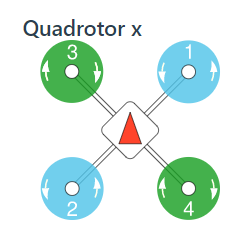

## PX4常见问题
 1. PX4无电流计使用

   `CBRK_SUPPLY_CHK`设置为894281

2. PX4禁用安全开关

   `CBRK_IO_SAFETY`设置为22027

3. 四旋翼机架定义

   


4. gazebo仿真启动失败时，杀掉有关gazebo服务器的所有进程：

   ```shell
   top #查看进程
   kill [PID] #PID为进程号
   ```


## PX4在ROS下进行gazebo仿真

1. 安装ROS和Gazebo

2. 完整克隆PX4源码

   ```shell
   git clone https://github.com/PX4/PX4-Autopilot.git --recursive
   ```

3. 安装MAVROS

4. 编译源码

   ```shell
   cd Firmware
   make px4_sitl_default gazebo #会直接运行
   ```

5. source环境变量和启动仿真环境

   ```shell
   source Tools/setup_gazebo.bash $(pwd) $(pwd)/build/px4_sitl_default
   export ROS_PACKAGE_PATH=$ROS_PACKAGE_PATH:$(pwd)
   export ROS_PACKAGE_PATH=$ROS_PACKAGE_PATH:$(pwd)/Tools/sitl_gazebo
   roslaunch px4 posix_sitl.launch #运行了make px4_sitl_default gazebo 就不用运行这个了
   ```

6. 启动MAVROS

   ```shell
   roslaunch mavros px4.launch fcu_url:="udp://:14540@127.0.0.1:14557"
   ```

